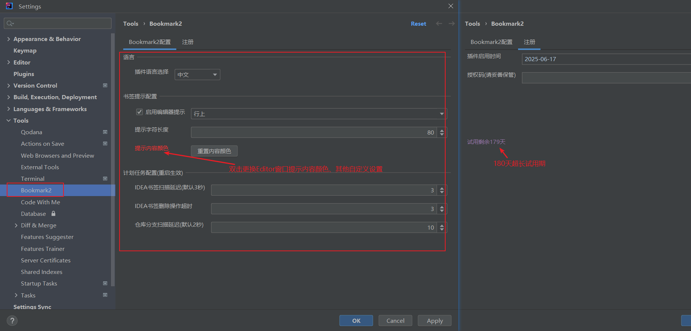
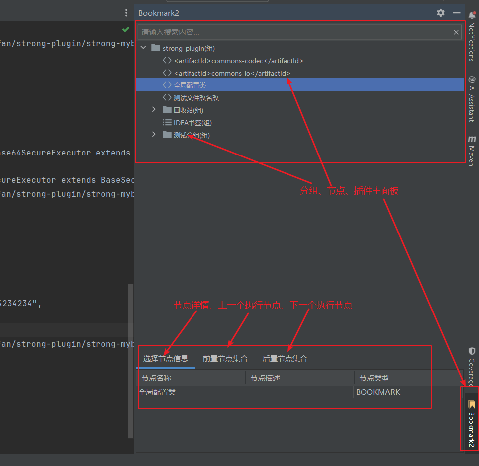
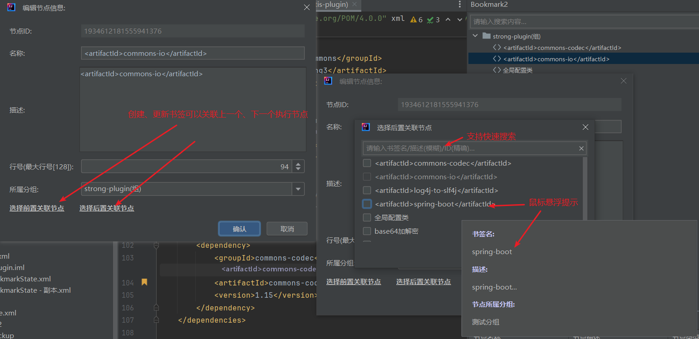
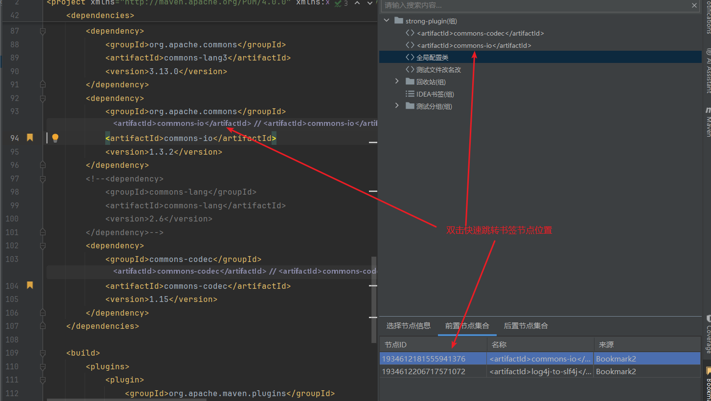
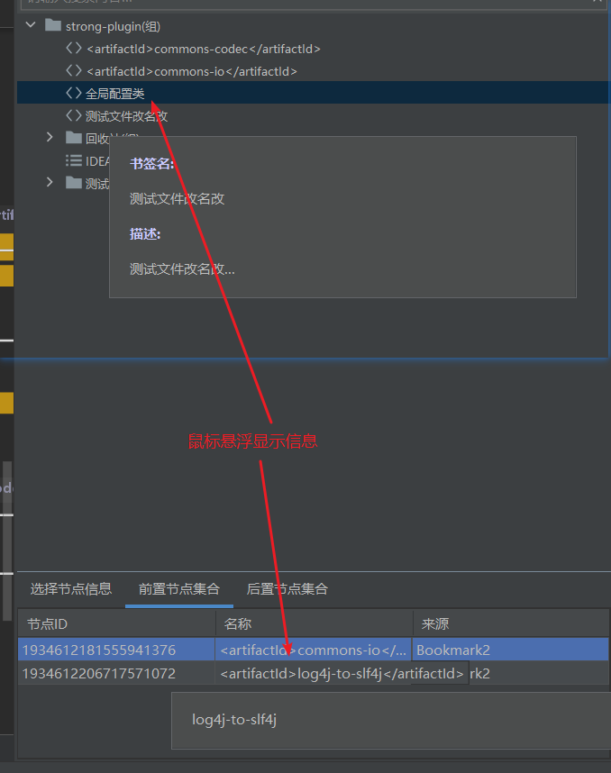
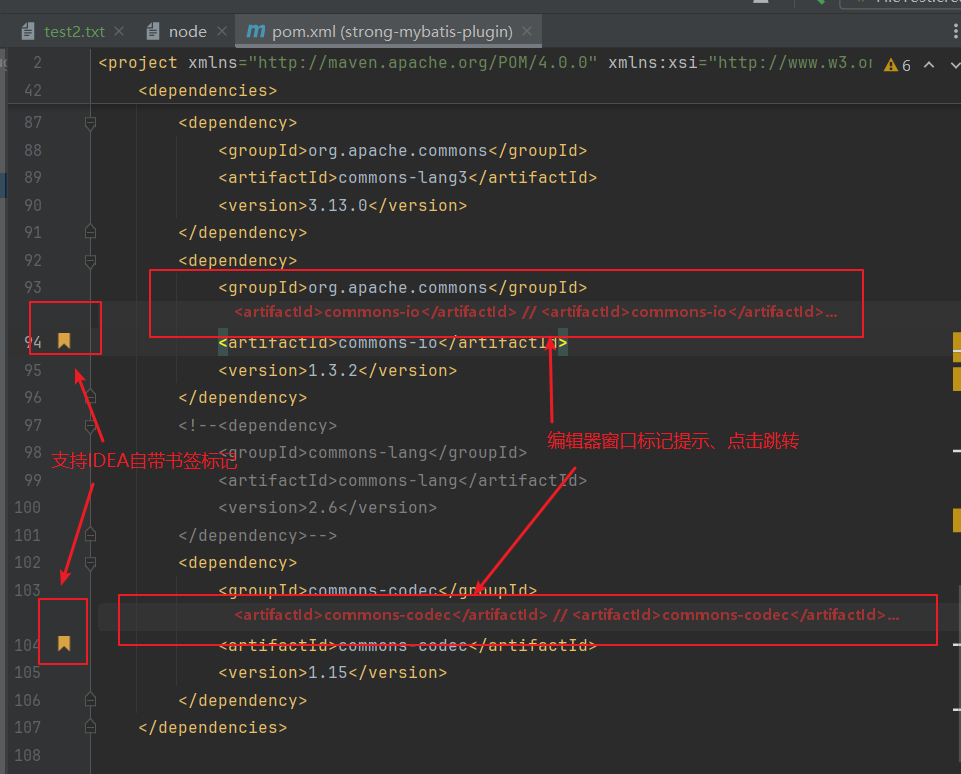

# 配置(Setting)
setting -> tools -> bookmark2

 

# 首页(Home)

 

# 创建(Create)
selected line -> keymap:Alt+Shift+A

 

# 跳转(Skip node)
selected -> double click

 

# 树提示(Tip for tree)

 

# 编辑窗口提示(Editor tip)
